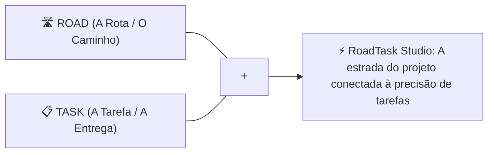

# 🛣️ RoadTask Studio — Identidade Visual Oficial

Apresentamos a identidade visual definitiva do sistema: **RoadTask Studio** *(Executive Timeline Engine)*.

Este manual consolida o novo posicionamento de marca, os logotipos de alta resolução, a conexão com o conceito original das **3 barras em cascata** e a especificação da **micro-animação vetorial SVG interativa** já ativa no produto.

---

## 🎯 1. O Significado de "RoadTask"

A marca **RoadTask Studio** nasceu da convergência perfeita entre a estratégia de longo prazo e a execução precisa de tarefas:

* **Road (A Estrada / A Trilha):** Representa o roadmap de alto nível, a rota traçada pela diretoria, a direção clara do início até o Go-Live.
* **Task (A Tarefa / O Esforço):** Representa o elemento fundamental de engenharia (WBS), com duração em dias úteis, predecessoras encadeadas e folga zero no Caminho Crítico.
* **Studio (O Estúdio Executivo):** Evoca um ambiente autônomo, refinado e poderoso para modelagem de cenários e apresentações C-Level.

---

## 🎨 2. Logotipo Oficial em Alta Resolução

Baseado no rascunho de três barras horizontais sobre fundo escuro, desenvolvemos a arte vetorial de alta definição para a marca:

### O Duplo Sentido Visual das Três Barras:
1. **As Faixas de uma Rodovia Digital (*Road*):** As três barras escalonadas remetem às linhas e faixas de uma estrada vista em perspectiva acelerada, transmitindo velocidade, fluidez e avanço contínuo.
2. **O Diagrama de Gantt Executivo (*Task*):** É a silhueta clássica inconfundível de um cronograma em cascata (*Fase > Tarefa > Marco*).

---

## 🎬 3. Micro-Animação Vetorial SVG/CSS em Tempo Real

No código-fonte ([RoadTaskLogo.tsx](file:///c:/Users/marci/Documents/Positivo/Projetos/EditorGantt/src/components/brand/RoadTaskLogo.tsx)), a insígnia foi implementada em **SVG puro + CSS Keyframes acelerado por GPU**, pesando apenas alguns bytes:

### Estrutura da Animação:
* **Barra 1 (Fase Inicial / Topo):** Gradiente safira ciano (`#38BDF8` a `#0284C7`) com pulso luminoso que inicia no tempo $0.0s$.
* **Barra 2 (Execução Ativa / Centro):** Gradiente azul intenso (`#0EA5E9` a `#2563EB`) com pulso luminoso sincronizado em offset ($+0.4s$).
* **Barra 3 (Entrega / Conclusão):** Gradiente safira com pulso em offset ($+0.8s$).
* **Onda Sequencial Contínua:** A luz percorre as três barras de cima para baixo como o tráfego fluindo em uma rodovia ou tarefas sendo concluídas sucessivamente no cronograma.
* **Aura Neon Dinâmica:** Brilho difuso ambiental (`blur-md`) com respiração contínua (`animate-pulse`).

---

## 📐 4. Paleta de Cores e Tipografia

| Elemento | Token | HEX | Aplicação |
| :--- | :--- | :--- | :--- |
| **Fundo Chassis** | `obsidian-950` | `#080C16` | Fundo sólido, escuro e austero da insígnia e do app. |
| **Trilha Primária** | `safira-400` | `#38BDF8` | Brilho neon de tarefas ativas e barras de destaque. |
| **Trilha Secundária**| `safira-500` | `#0EA5E9` | Gradiente intermediário de tarefas em andamento. |
| **Trilha Profunda** | `safira-600` | `#0284C7` | Base sólida das barras de Gantt. |
| **Núcleo de Luz** | `safira-50` | `#E0F2FE` | Linha de feixe de luz que corre dentro de cada barra. |
| **Tipografia** | Inter ExtraBold | `#FFFFFF` | "ROADTASK" em branco puro com espaçamento amplo. |

---

## 🚀 5. Onde a Marca já está Operando

1. **Cabeçalho Executivo ([ExecutiveHeader.tsx](file:///c:/Users/marci/Documents/Positivo/Projetos/EditorGantt/src/components/layout/ExecutiveHeader.tsx)):** A insígnia animada das 3 barras azuis já está ativa no canto superior esquerdo.
2. **Aba do Navegador & Favicon ([index.html](file:///c:/Users/marci/Documents/Positivo/Projetos/EditorGantt/index.html)):** O favicon SVG foi atualizado com as três barras azuis escalonadas e o título alterado para `RoadTask Studio | Executive Timeline & Gantt Engine`.
3. **Executável Standalone:** Sincronizado e pronto para uso offline em `editor_cronograma.html` (320.83 kB).
